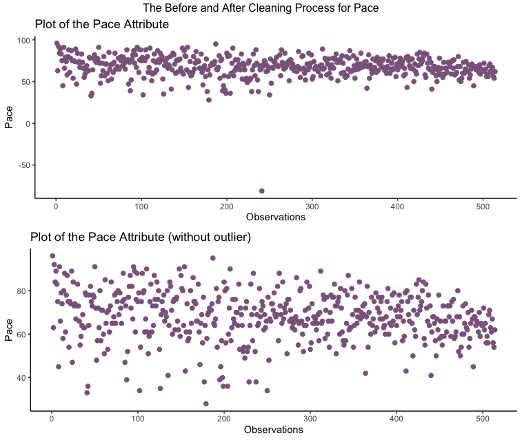

# ****European Football Player - Statistical Data Analysis (R)****

## **Project Overview**

- **Objective:** This project aims to conduct a comprehensive statistical analysis of European Football Player data, emphasizing data quality analysis, exploratory data analysis (EDA), and statistical modeling.
- The analysis provides insights into factors influencing a player's potential and their likelihood of earning a weekly wage above 8000 Euro.
- Key statistical analysis include:
    - **ANCOVA Analysis:** Assessing factors influencing a player's potential.
    - **Logistic Regression Analysis:** Investigating factors affecting a player's likelihood to earn a high weekly wage.
- R libraries used: dplyr, ggplot2, gridExtra, grid, corrplot, reshape2.
- Access the document in RMarkdown, HTML, and PDF formats.

## **Data Quality Analysis (Section #1)**

- **Objective:** Ensure data accuracy, consistency, and reliability.
- Key steps:
    - Data summary
    - Identifying numerical and categorical variables
    - Handling outliers
    - Addressing missing data
    - Visualizing data anomalies

Examples of Data Cleaning

